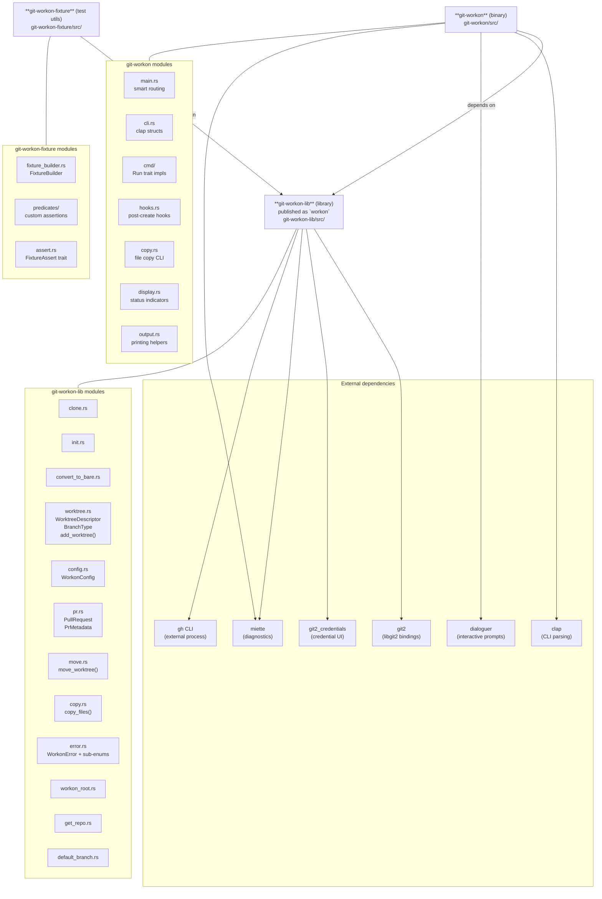
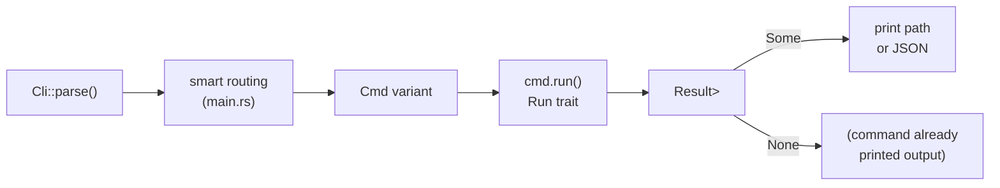

# Crate Architecture

The workspace contains three crates with a clear dependency hierarchy. The CLI binary depends on the core library; test utilities depend on the library; external dependencies are shared via `[workspace.dependencies]`.

## Run trait dispatch pattern

Every command struct implements `Run`, which returns the created/found worktree (if any). `main.rs` prints the path or JSON after dispatch.

## Key files

- `Cargo.toml` — workspace definition and shared dependencies
- `git-workon/src/main.rs` — entry point, smart routing, output
- `git-workon/src/cli.rs` — all `clap` argument structs
- `git-workon/src/cmd/` — one file per subcommand, each implements `Run`
- `git-workon-lib/src/lib.rs` — public re-exports of the library
- `git-workon-lib/src/error.rs` — all error types
- `git-workon-fixture/src/` — test infrastructure
