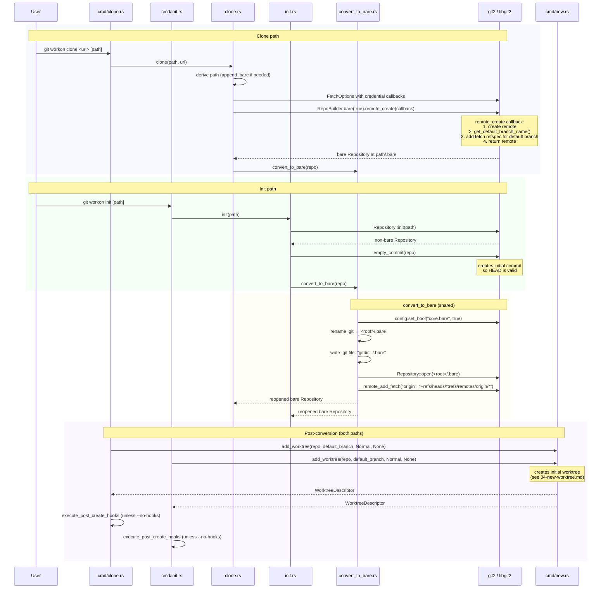

# Clone & Init Flows

Both `clone` and `init` produce the same end state: a bare repository at `<path>/.bare` with a `.git` link file, ready for worktrees. They converge at `convert_to_bare`.



## Directory structure after clone/init

```
my-project/          ← workon root (workon_root())
├── .bare/           ← actual git repo (core.bare=true)
│   ├── config
│   ├── HEAD
│   ├── refs/
│   ├── worktrees/
│   └── ...
├── .git             ← link file: "gitdir: ./.bare"
└── main/            ← initial worktree (branch: main)
    ├── .git         ← link: "gitdir: ../.bare/worktrees/main"
    └── ... (working files)
```

## workon_root() discovery

`workon_root()` (`git-workon-lib/src/workon_root.rs`) finds the common ancestor between the `.git` directory and the current working directory. This is what makes the sibling-worktrees layout work correctly from any directory.

## Key files

- `git-workon-lib/src/clone.rs` — bare clone with credential callbacks
- `git-workon-lib/src/init.rs` — init + empty commit + convert
- `git-workon-lib/src/convert_to_bare.rs` — shared conversion logic
- `git-workon-lib/src/workon_root.rs` — root directory discovery
- `git-workon-lib/src/default_branch.rs` — remote default branch detection
- `git-workon/src/cmd/clone.rs` — CLI wrapper, hooks
- `git-workon/src/cmd/init.rs` — CLI wrapper, hooks
