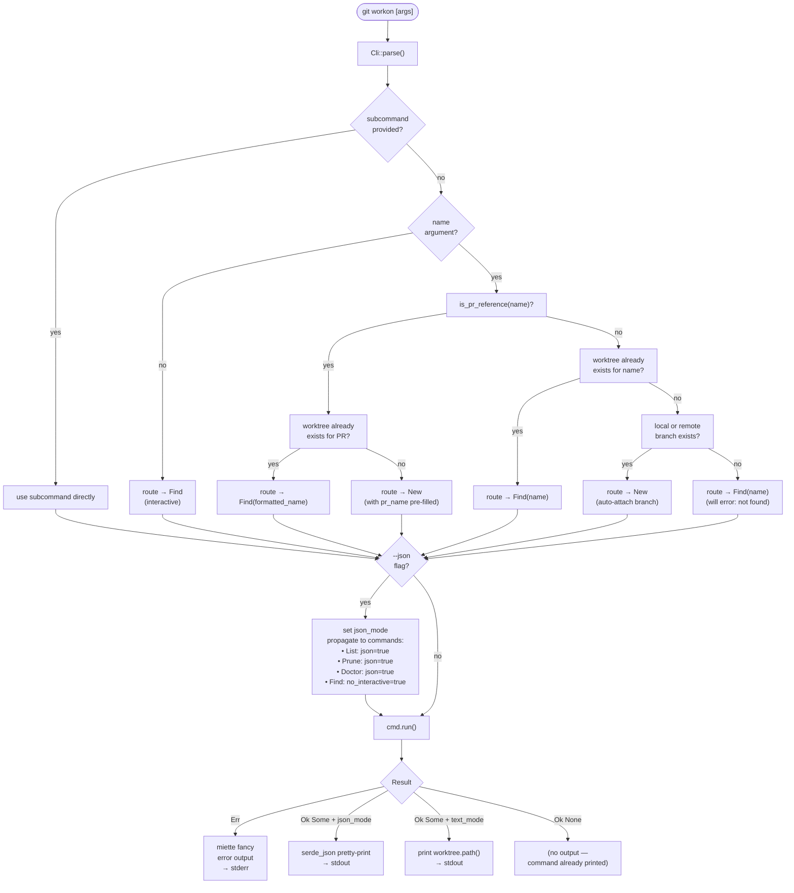

# Smart Routing & Command Dispatch

When `git workon <arg>` is called without an explicit subcommand, `main.rs` performs smart routing: PR-like references go to `new`, names matching an existing branch with no worktree go to `new`, everything else goes to `find`. With an explicit subcommand, dispatch is direct.

## PR reference detection

`is_pr_reference()` and `route_pr_ref_to_command()` in `main.rs`:

1. Parse the name with `parse_pr_reference()` — returns `None` if not a PR ref
2. Load config to get `workon.prFormat`
3. Format the expected worktree name with `format_pr_name()`
4. Check if that worktree already exists via `repo.find_worktree()`
5. If exists → `Find`; if not → `New` (with pre-filled name)

## Branch detection

`route_branch_to_command()` and `branch_exists()` in `main.rs`:

1. Check if a worktree already exists for the name — if so, return `None` (let `Find` handle it)
2. Check for a local branch via `repo.find_branch(name, Local)`
3. Check remote tracking branches by short name: `"origin/feature"` matches `"feature"`
4. If any branch found → `New` (auto-attach, no `--branch` flag needed); otherwise → `None` → `Find`

## JSON propagation details

`--json` is a global flag on `Cli`. After routing, `main.rs` explicitly sets fields on the selected command variant before calling `run()`:

| Command | Effect of `--json` |
|---|---|
| `List` | `list.json = true` → prints JSON array, returns `None` |
| `Prune` | `prune.json = true` → prints JSON result, returns `None` |
| `Doctor` | `doctor.json = true` → prints JSON issues, returns `None` |
| `Find` | `find.no_interactive = true` → errors instead of prompting |
| Others | no change — `Some(worktree)` is JSON-printed by `main` |

## Key files

- `git-workon/src/main.rs` — routing, JSON propagation, output (`route_pr_ref_to_command`, `route_branch_to_command`, `branch_exists`)
- `git-workon/src/cli.rs` — `Cli`, `Cmd`, and all arg structs
- `git-workon-lib/src/pr.rs` — `is_pr_reference()`, `parse_pr_reference()`
