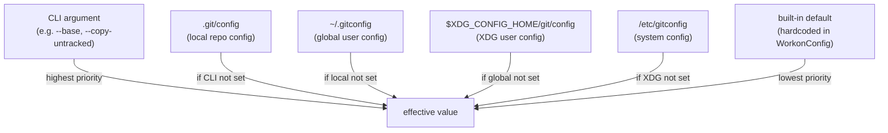

# Configuration System

`git-workon` stores all settings under the `workon.*` namespace in standard git config files. `WorkonConfig` reads from the repository's layered config (local → global → system), so settings can be set globally in `~/.gitconfig` or per-repo in `.git/config`.

## Config key reference

| Key | Type | Default | Description |
|---|---|---|---|
| `workon.defaultBranch` | string | `None` | Base branch for new worktrees when no `--base` is given |
| `workon.postCreateHook` | multi-value | `[]` | Shell commands run after worktree creation (sequential) |
| `workon.copyPattern` | multi-value | `[]` | Glob patterns for automatic file copying (`**/*` if empty) |
| `workon.copyExclude` | multi-value | `[]` | Glob patterns excluded from file copying |
| `workon.autoCopyUntracked` | bool | `false` | Auto-copy files matching `copyPattern` on `new` |
| `workon.pruneProtectedBranches` | multi-value | `[]` | Branch patterns exempt from `prune` |
| `workon.prFormat` | string | `"pr-{number}"` | Worktree name format for PR-based worktrees |
| `workon.hookTimeout` | integer (seconds) | `300` | Max time per hook; `0` = no timeout |

## Precedence flowchart



Precedence is handled by git2's `Repository::config()` which automatically applies the standard git config stack. `WorkonConfig` simply calls `config.get_string()` / `config.get_bool()` / `config.get_i64()` and git2 returns the highest-priority value.

For multi-value keys (`workon.postCreateHook`, etc.), `config.multivar()` returns entries from all levels merged together, with local entries taking precedence within the same key.

## Protected branch pattern matching

`workon.pruneProtectedBranches` supports three glob patterns (no external glob library — implemented directly in `prune.rs`):

| Pattern | Matches |
|---|---|
| `main` | exactly `main` |
| `*` | any branch |
| `release/*` | `release/v1`, `release/v2.0`, etc. (prefix with `/`) |
| `*/branch` | any namespace prefix: `user/branch`, `team/branch` |

## PR format validation

`workon.prFormat` is validated by `WorkonConfig::pr_format()`:

1. Must contain `{number}` placeholder (required)
2. All `{...}` tokens must be valid placeholders: `{number}`, `{title}`, `{author}`, `{branch}`
3. Invalid placeholders return `ConfigError::InvalidPrFormat`

Non-`{number}` placeholder values are sanitized for use in branch names: lowercased, special characters replaced with `-`, consecutive dashes collapsed, leading/trailing dashes stripped.

## Example configuration

```gitconfig
# ~/.gitconfig — personal preferences
[workon]
    defaultBranch = main
    prFormat = pr-{number}-{author}

# .git/config — project-specific
[workon]
    postCreateHook = npm install
    postCreateHook = cp ../.env .env
    copyPattern = .env.local
    copyPattern = node_modules/
    copyExclude = .env.production
    autoCopyUntracked = true
    pruneProtectedBranches = main
    pruneProtectedBranches = develop
    pruneProtectedBranches = release/*
    hookTimeout = 120
```

## Key files

- `git-workon-lib/src/config.rs` — `WorkonConfig` struct with all accessor methods
- `git-workon-lib/src/error.rs` — `ConfigError::InvalidPrFormat`, `ConfigError::NoValue`
- `git-workon/src/cmd/prune.rs` — `is_protected()`, `glob_match()` (protected branch matching)
- `git-workon/src/cmd/doctor.rs` — `read_config_entries()` (config display with source paths)
