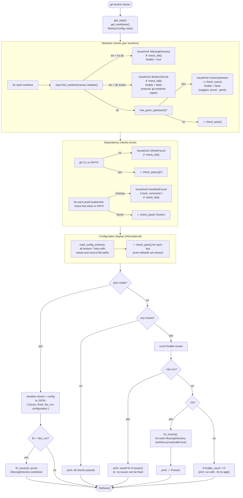

# Doctor Command

`doctor` (alias: `check`) inspects the workspace for problems and optionally fixes them. It runs three check categories — worktrees, dependencies, and configuration — and reports results inline as they are discovered.

## Issue types

| Kind | Fixable | Condition | Action |
|---|---|---|---|
| `MissingDirectory` | yes | `validate()` fails + path doesn't exist | `worktree.prune(valid=true)` |
| `BrokenGitLink` | no | `validate()` fails + path exists | user must run `git worktree repair` |
| `GoneUpstream` | no | `validate()` ok + `has_gone_upstream()` | suggest `git workon prune --gone` |
| `HookNotFound` | no | hook command not in PATH | user must install the tool |
| `GhNotFound` | no | `gh` not in PATH | PR features unavailable |

## Configuration display

`read_config_entries()` shows all 8 `workon.*` keys with their current value and the config file that set it (abbreviated as `~/<path>`). Keys that are at default (not set in any file) show `None` as source.

## Key files

- `git-workon/src/cmd/doctor.rs` — `Run` impl, all check logic, `fix_issues()`, `read_config_entries()`
- `git-workon-lib/src/worktree.rs` — `WorktreeDescriptor::has_gone_upstream()`, `validate()` via git2
- `git-workon-lib/src/config.rs` — `WorkonConfig` for reading hook and config data
