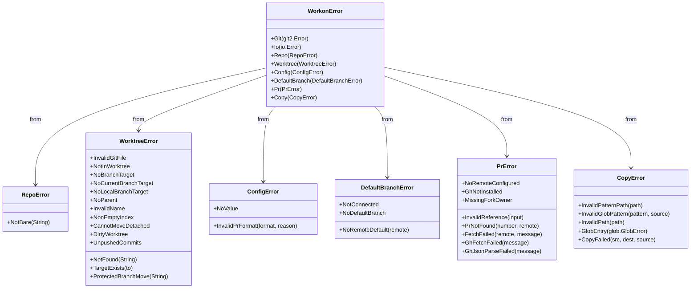
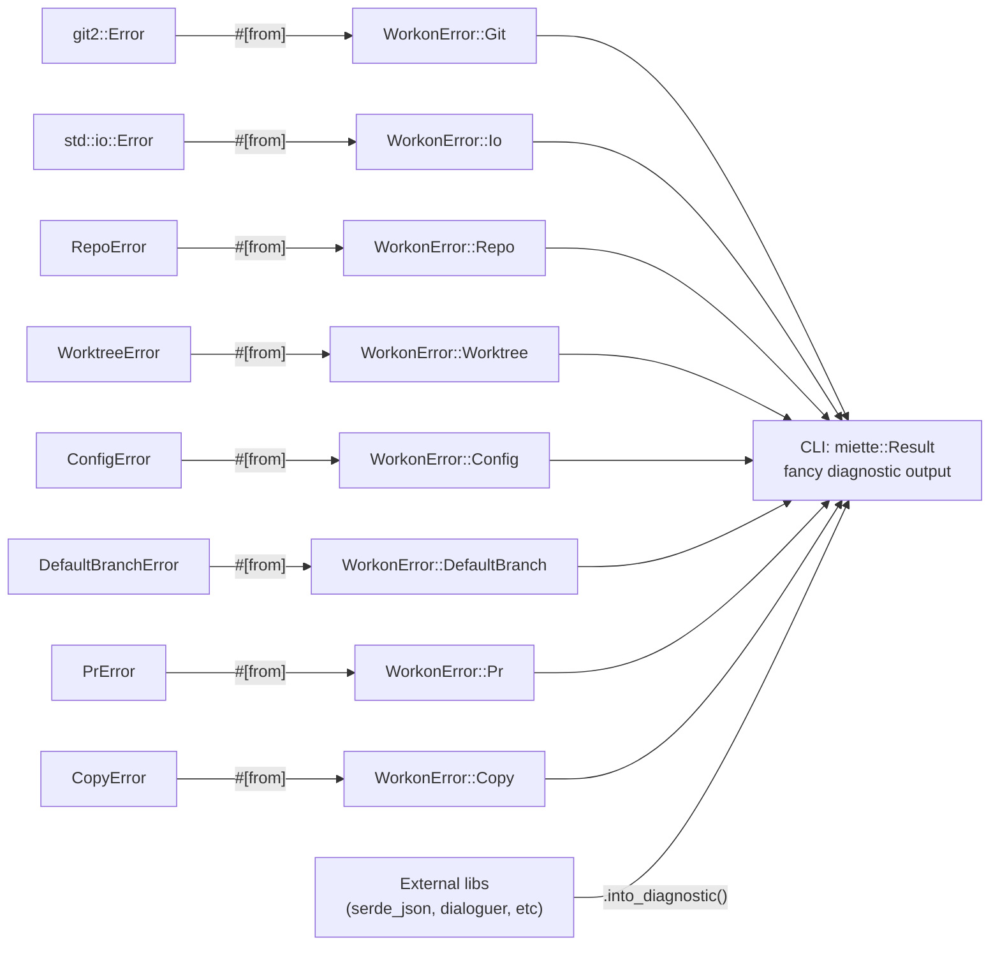

# Error Types

All errors in `git-workon-lib` implement both `std::error::Error` (via `thiserror`) and `miette::Diagnostic` for rich terminal output. The CLI propagates library errors unchanged and converts external library errors with `.into_diagnostic()`.

## Diagnostic codes

Each variant carries a `#[diagnostic(code(workon::...))]` attribute. Code namespaces follow the module structure:

| Namespace | Error type |
|---|---|
| `workon::git_error` | `WorkonError::Git` |
| `workon::io_error` | `WorkonError::Io` |
| `workon::repo::*` | `RepoError` variants |
| `workon::worktree::*` | `WorktreeError` variants |
| `workon::config::*` | `ConfigError` variants |
| `workon::default_branch::*` | `DefaultBranchError` variants |
| `workon::pr::*` | `PrError` variants |
| `workon::copy::*` | `CopyError` variants |

## Conversion flow

## CLI error handling rules

- Library errors (`WorkonError` and sub-enums) propagate unchanged — they already implement `Diagnostic`
- External library errors use `.into_diagnostic()` to convert to `miette::Report`
- `.wrap_err()` adds user-facing context for operations that might fail (file I/O, URL parsing)
- Library code never uses `.into_diagnostic()` — it defines concrete error types instead

## Key files

- `git-workon-lib/src/error.rs` — `WorkonError` and all sub-enums
- Domain-specific variants are defined in the same file but grouped by sub-enum
