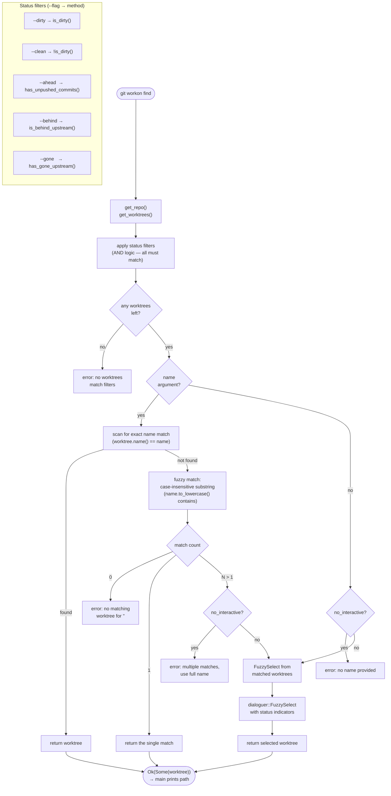

# Find Command

`find` locates a worktree using a three-mode strategy: exact match → single fuzzy match → interactive selection. Status filters narrow the candidate set before any name matching occurs.

## Status indicators in interactive display

The `display.rs` module formats each worktree row with status indicators derived from `WorktreeDescriptor` methods. Indicators appear before the worktree name:

| Indicator | Meaning | Method |
|---|---|---|
| `*` | Dirty (uncommitted changes) | `is_dirty()` |
| `↑` | Ahead of upstream (unpushed commits) | `has_unpushed_commits()` |
| `↓` | Behind upstream | `is_behind_upstream()` |
| `✗` | Upstream branch gone (deleted on remote) | `has_gone_upstream()` |
| `→` | Currently active worktree | `current_dir` starts_with path |

## Filter semantics

- All active filters are combined with AND logic: `--dirty --ahead` shows only worktrees that are both dirty AND ahead
- Filters operate on the full worktree list before name matching; `git workon find feat --ahead` finds `feat*` worktrees that also have unpushed commits
- `no_interactive` is set automatically by `--json` (see `02-command-dispatch.md`) to prevent prompts in JSON mode

## Key files

- `git-workon/src/cmd/find.rs` — `Run` impl, `matches_filters()`, `select_from_list()`
- `git-workon/src/display.rs` — `worktree_display_row()`, status indicators
- `git-workon-lib/src/worktree.rs` — `WorktreeDescriptor` status methods
