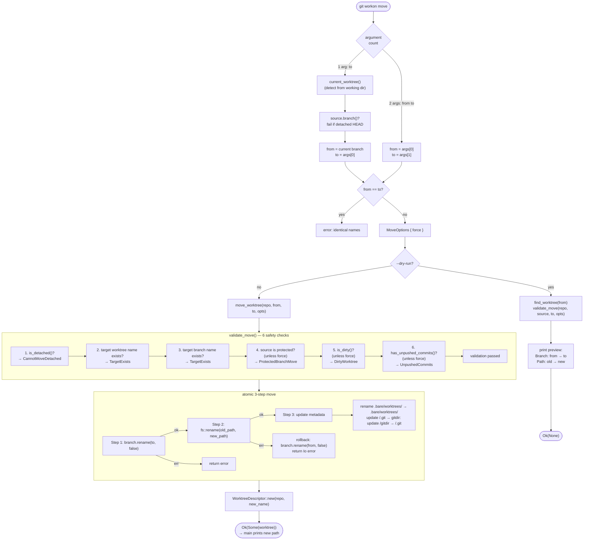

# Move Worktree

`move` renames a worktree and its branch atomically, keeping directory structure and git metadata in sync. The operation includes rollback if the directory move fails after the branch rename.



## Namespace support

Branch names containing `/` are supported, enabling moves between namespaces. `worktree_name` is derived as the basename (`Path::file_name()`) of the branch name. Parent directories are created automatically:

```
git workon move feature user/feature     # moves into namespace
git workon move user/feature feature     # moves out of namespace
git workon move old/path new/deep/path   # cross-namespace
```

## Metadata update details

After directory rename, two files are updated to keep git's bidirectional pointers consistent:

| File | Content |
|---|---|
| `<bare>/.bare/worktrees/<new_name>/gitdir` | `<new_worktree_path>/.git` |
| `<new_worktree_path>/.git` | `gitdir: <bare>/.bare/worktrees/<new_name>` |

## Key files

- `git-workon/src/cmd/move.rs` — `Run` impl, argument parsing, dry-run display
- `git-workon-lib/src/move.rs` — `move_worktree()`, `validate_move()`, `MoveOptions`, rollback logic
- `git-workon-lib/src/worktree.rs` — `current_worktree()`, `find_worktree()`, status check methods
