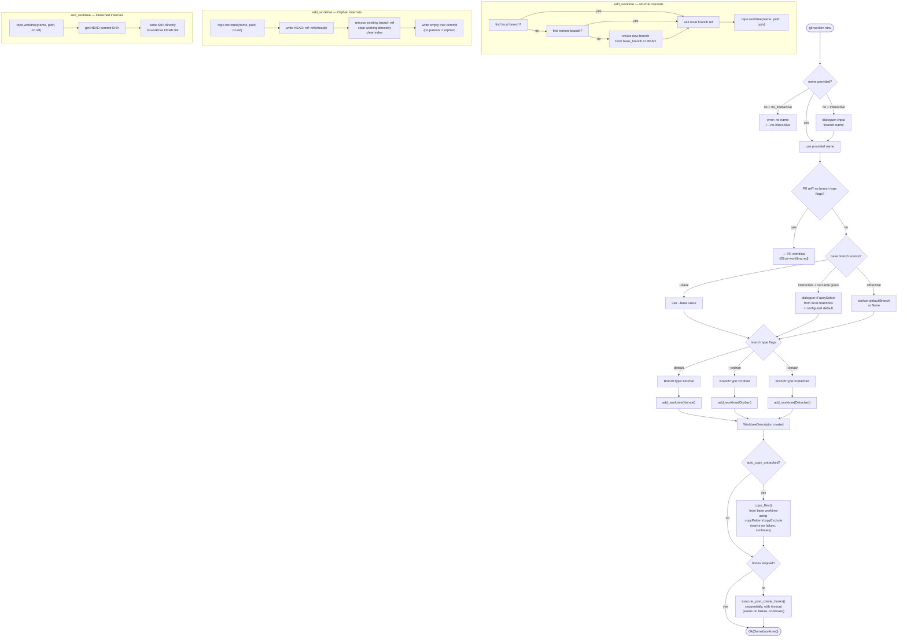

# New Worktree (Regular Path)

The `new` command creates a worktree for a branch. If the name looks like a PR reference, it delegates to the PR workflow (see `05-pr-workflow.md`). Otherwise it follows this path.

## Hook environment variables

Each hook command runs via `sh -c` in the new worktree directory with:

| Variable | Value |
|---|---|
| `WORKON_WORKTREE_PATH` | Absolute path to the new worktree |
| `WORKON_BRANCH_NAME` | Branch name (if not detached HEAD) |
| `WORKON_BASE_BRANCH` | Base branch used for creation (if applicable) |

## copy_untracked resolution

The `--copy-untracked` / `--no-copy-untracked` flags override `workon.autoCopyUntracked`. When copying is enabled:

1. Patterns from `workon.copyPattern` are used (default: `**/*` if not set)
2. Patterns from `workon.copyExclude` are excluded
3. Source path is `<workon_root>/<base_branch>` — must exist, otherwise copy is skipped

## Key files

- `git-workon/src/cmd/new.rs` — `Run` impl, interactive prompts, PR detection, copy/hook orchestration
- `git-workon-lib/src/worktree.rs` — `add_worktree()`, `BranchType`, all three branch type implementations
- `git-workon/src/hooks.rs` — `execute_post_create_hooks()`, timeout logic, env vars
- `git-workon-lib/src/copy.rs` — `copy_files()`, glob pattern matching
