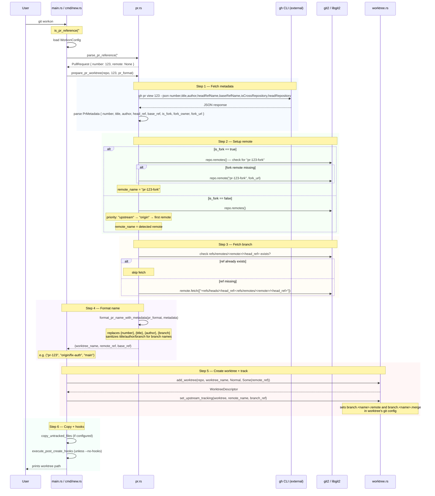

# PR Worktree Creation

When a name is detected as a PR reference (in `new` or via smart routing), the PR workflow fetches metadata via `gh` CLI, sets up the correct remote, fetches the branch, and creates a tracked worktree.

## PR reference formats

`parse_pr_reference()` in `pr.rs` recognises these input patterns:

| Format | Example | Notes |
|---|---|---|
| `#N` | `#123` | GitHub shorthand, most common |
| `pr#N` | `pr#123` | Explicit PR prefix |
| `pr-N` | `pr-123` | Dash variant |
| GitHub URL | `https://github.com/owner/repo/pull/123` | Full URL |
| Remote ref | `origin/pull/123/head` | Direct remote ref |

`is_pr_reference()` wraps `parse_pr_reference()` for quick boolean routing checks.

## prFormat placeholders

`workon.prFormat` (default: `pr-{number}`) supports these placeholders. Title, author, and branch values are sanitized (lowercased, non-alphanumeric chars → `-`, consecutive dashes collapsed):

| Placeholder | Source |
|---|---|
| `{number}` | PR number (required) |
| `{title}` | PR title (sanitized) |
| `{author}` | GitHub login of PR author (sanitized) |
| `{branch}` | Head branch name (sanitized) |

## Key files

- `git-workon-lib/src/pr.rs` — all PR parsing, metadata fetching, remote setup, `prepare_pr_worktree()`
- `git-workon/src/cmd/new.rs` — PR detection in `run()`, upstream tracking, copy/hooks after PR worktree
- `git-workon/src/main.rs` — `route_pr_ref_to_command()` for smart routing
