# Prune Command (Always-On Analysis + Picker)

`prune` runs one analysis pass over every worktree in scope, plus (by default) every local branch with no worktree, then dispatches to one of three interaction modes. `--gone`/`--merged` only decide which signals are "active" (pre-checked / auto-pruned); they never hide a row from the analysis. `--no-branches` / `workon.pruneBranches = false` drops the branch-only rows before analysis even starts.

```mermaid
flowchart TD
    START([git workon prune]) --> SETUP["get_repo()\nget_worktrees()\nload WorkonConfig + pruneProtectedBranches\nresolve effective_gone / effective_fetch / effective_branches"]

    SETUP --> BPOOL{effective_branches\n&& !keep_branch?}
    BPOOL -->|yes| BRANCHPOOL["branch_pool = every local branch\nwith no worktree, minus checked_out\n(every worktree's branch, not just the pool)\nand the default branch"]
    BPOOL -->|no| SCOPE
    BRANCHPOOL --> SCOPE{names given?}
    SCOPE -->|no| POOL["scope = every worktree\nexcept the default one\nbranch_scope = branch_pool"]
    SCOPE -->|yes| MATCH["match each name against the worktree pool\nfirst, then branch_pool by branch name\n(default branch excluded from both)"]
    MATCH --> MISS{any name\nunmatched?}
    MISS -->|yes| ERR["hard error: PruneError::NamesNotFound\nlists ALL misses — nothing touched\nnonzero exit"]
    MISS -->|no| NAMED["scope = matched worktrees\nbranch_scope = matched branches"]

    POOL --> FETCH
    NAMED --> FETCH

    subgraph FETCH0["Phase 0 (optional) — Prune-fetch"]
        FETCH{effective_fetch?}
        FETCH -->|yes| REMOTES["remotes tracked by scope + branch_scope\n(narrowed to named worktrees/branches\nwhen names given)"]
        REMOTES --> DOFETCH["git fetch --prune per remote\nfailure: warn + continue on cached refs"]
        FETCH -->|no| ANALYZE
        DOFETCH --> ANALYZE
    end

    subgraph ANALYSIS["Analysis — every row in scope, always"]
        ANALYZE["build_row() per worktree, then\nbuild_branch_row() per branch_scope entry\n(worktree rows always first — the gh pass\nbelow visits rows in order)\nsignals: BranchDeleted | RemoteGone | Merged(target) | PrMerged(number)\n+ protected / locked / dirty / unmerged\n(branch rows: locked/dirty always false)"]
        ANALYZE --> VISIBLE{bare mode?}
        VISIBLE -->|yes| FILTERSIG["keep only rows with >=1 signal"]
        VISIBLE -->|no named| KEEPALL["keep every named row\n(signal or not)"]
    end

    FILTERSIG --> DISPATCH
    KEEPALL --> DISPATCH

    subgraph DISPATCH_BLOCK["Dispatch"]
        DISPATCH{mode?}
        DISPATCH -->|--dry-run, !json| DRYTEXT["render annotated table:\n[pre-checked] / [selectable] / [locked out]\nwith signals — no deletion"]
        DISPATCH -->|TTY && !yes && !json && !dry-run| PICKER
        DISPATCH -->|--yes / --json / no TTY| CLASSIFY
    end

    subgraph PICKER_BLOCK["Interactive picker"]
        PICKER["locked-out rows (protected/locked,\nnot overridden) -> printed list, not selectable"]
        PICKER --> MULTI["picker::multi_select over selectable rows\n(find/list row style + dim prune annotation;\nspace: toggle, a: all, enter: confirm)\ndefaults = pre-checked per active-criteria + safety"]
        MULTI --> SUMMARY["one summary confirm:\n'N worktree(s) and their branches will be deleted'\n(branch rows annotated 'no worktree, ...')\n+ dirty/unmerged + orphaned-stash warnings"]
        SUMMARY -->|confirmed| EXEC
        SUMMARY -->|declined| CANCEL(["Cancelled"])
    end

    subgraph CLASSIFY_BLOCK["classify(): to_prune vs skipped"]
        CLASSIFY{named?}
        CLASSIFY -->|no| ACTIVE{signal active?\nBranchDeleted always;\nPrMerged always;\nRemoteGone iff --gone;\nMerged iff --merged}
        ACTIVE -->|no| DROP["not a candidate\n(not shown, not skipped)"]
        ACTIVE -->|yes| SAFETY
        CLASSIFY -->|yes| HEALTHY{healthy?\nno signal AND !dirty AND !unmerged}
        HEALTHY -->|yes, !force| SKIP_HEALTHY["skipped: not prunable\n(no signal); use --force"]
        HEALTHY -->|yes, force| SAFETY
        HEALTHY -->|no| SAFETY

        SAFETY["blocked_reason(): protected -> locked -> dirty -> unmerged\n(each overridable: --force / --include-locked / --allow-dirty / --allow-unmerged)"]
        SAFETY -->|blocked| SKIP_SAFETY["skipped: reason"]
        SAFETY -->|clear| TOPRUNE["to_prune"]
    end

    subgraph EXEC_BLOCK["Execution"]
        EXEC["worktree row: remove_dir_all -> worktree.prune()\n-> delete local branch ref\n(unless --keep-branch or BranchDeleted signal)\nbranch-only row: prune_branch() deletes\nthe branch ref directly, no ordering guard needed"]
        EXEC --> ORPHAN["warn per orphaned stash\n(collect_orphaned_stashes — worktree rows only)"]
    end

    TOPRUNE --> JSONQ{--json?}
    JSONQ -->|yes| JSONOUT["emit {pruned, skipped, dry_run}\neach entry includes 'signals' and 'kind'\n('worktree' or 'branch'; branch rows: 'path': null)\ndry-run: list without deleting"]
    JSONQ -->|no| CONFIRM{--yes?}
    CONFIRM -->|no| DIALOG["dialoguer::Confirm\n(only reachable non-TTY, no --yes)"]
    DIALOG -->|confirmed| EXEC
    DIALOG -->|denied| CANCEL
    CONFIRM -->|yes| EXEC

    EXEC --> DONE(["Ok(None)"])
    JSONOUT --> DONE
    DRYTEXT --> DONE
    ERR --> DONE2(["Err — nonzero exit"])
```

## Signal reference

| Signal | Meaning | Active when |
|---|---|---|
| `BranchDeleted` | local branch ref no longer exists | always |
| `RemoteGone` | upstream tracking ref is gone (`has_gone_upstream()`) | `--gone` / `workon.pruneGone` |
| `Merged(target)` | `is_merged_into(target)` — target is `--merged=BRANCH` or the default branch | `--merged` passed (with or without a value) |
| `PrMerged(number)` | `gh pr list --head <branch> --state merged` found a merged PR whose `headRefOid` is at or behind the branch's current tip (equal, or the tip is an ancestor of it) — only checked for otherwise signal-less rows, gated on a GitHub remote + `gh` being usable | always |

`PrMerged`'s SHA comparison guards against a stale match: a long-lived branch that was once a PR's head (gitflow's `develop`/`production`, a `release/*` line) stays a merged PR's head forever, even after moving on with commits the PR never saw. Without the comparison, the signal would fire permanently on such a branch. Known gap: a branch rewritten locally after its PR merged (restack, amend) no longer matches its old merged head, so it loses the signal too — it still surfaces via `--gone` after a fetch, or by naming the worktree.

A row can carry more than one signal (e.g. a fresh worktree off the default branch is always trivially `Merged(default)`). `reason_display()`/`annotate()` join every signal present, not just the active ones.

Branch-only rows (a local branch with no worktree) carry the same three real signals (`RemoteGone`, `Merged(target)`, `PrMerged(number)`), checked against the branch directly via `git-workon-lib/src/branch.rs` instead of through `WorktreeDescriptor`. `BranchDeleted` is moot for a branch-only row: the branch enumeration only ever considers branches that still exist, so there's no "branch ref no longer exists" state to detect.

## Key files

- `git-workon/src/cmd/prune.rs` — `Signal`, `PruneRow`, `build_row`, `build_branch_row`, `classify`, `is_prechecked`, `run_interactive`, `render_dry_run`, `emit_json`, `prune_branch`
- `git-workon/src/picker.rs` — `multi_select` (checkbox pick loop shared with the `find` picker's terminal handling)
- `git-workon/src/display.rs` — `worktree_display_row`, `format_aligned_rows_annotated` (find/list row style + trailing prune annotation)
- `git-workon-lib/src/worktree.rs` — `is_dirty()`, `has_tracked_changes()`, `is_merged_into()`, `has_gone_upstream()`, `is_locked()`
- `git-workon-lib/src/branch.rs` — `branch_has_gone_upstream()`, `branch_is_merged_into()`, `branch_tip_at_or_behind()` (the same three checks, against a branch with no worktree)
- `git-workon-lib/src/fetch.rs` — `remotes_tracked_by_worktrees()`, `remotes_tracked_by_branches()`
- `git-workon-lib/src/config.rs` — `prune_protected_branches()`, `prune_gone()`, `prune_fetch()`, `prune_branches()`
- `git-workon-lib/src/error.rs` — `PruneError::NamesNotFound`
