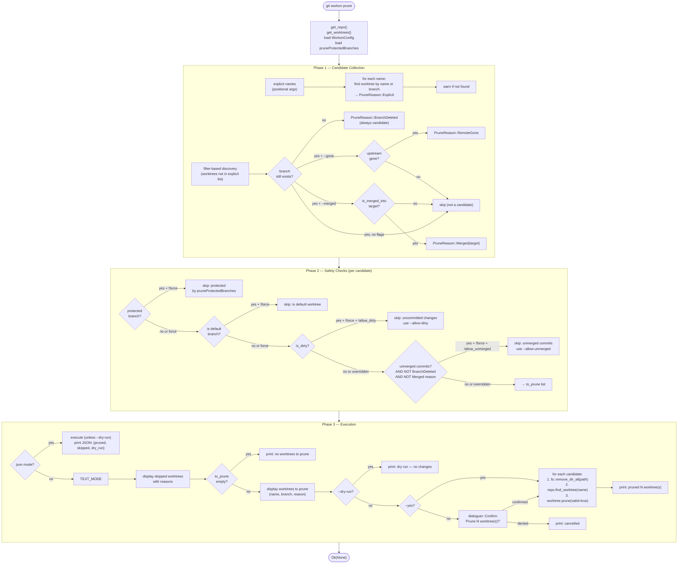

# Prune Command (3-Phase)

`prune` removes stale worktrees in three sequential phases: candidate collection, safety filtering, and execution. Phases are independent — safety checks always run even for explicitly named worktrees.

## PruneReason variants

| Reason | Source | Unmerged check? |
|---|---|---|
| `Explicit` | user-named argument | yes (checked against default branch) |
| `BranchDeleted` | local branch ref missing | skipped (work already handled) |
| `RemoteGone` | `--gone` flag, upstream ref missing | yes |
| `Merged(target)` | `--merged`, `is_merged_into()` returned true | skipped (already verified) |

## Force flag

`--force` is a single override that disables all four safety checks simultaneously: protected, default-branch, dirty, and unmerged. It does not affect JSON mode or dry-run behavior.

## Key files

- `git-workon/src/cmd/prune.rs` — all three phases, `PruneReason`, `PruneCandidate`, `is_upstream_gone()`, `is_protected()`
- `git-workon-lib/src/worktree.rs` — `WorktreeDescriptor::is_dirty()`, `is_merged_into()`, `has_gone_upstream()`
- `git-workon-lib/src/config.rs` — `prune_protected_branches()`, `is_protected()`
