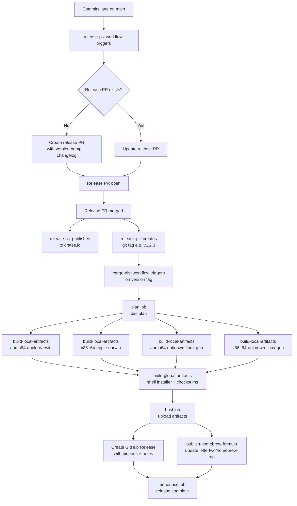

# Release Pipeline

End-to-end flow from commits landing on `main` to distributed binaries and a published crate.

## Phases

| Phase | Tool | Trigger | Output |
|---|---|---|---|
| Release PR | release-plz | Push to `main` | PR with version bump and changelog |
| crates.io publish | release-plz | Release PR merge | `workon` crate published |
| Git tag | release-plz | Release PR merge | Version tag (e.g. `v1.2.3`) |
| Binary builds | cargo-dist | Git tag push | Archives for 4 targets |
| GitHub Release | cargo-dist | Git tag push | Release with binaries and notes |
| Homebrew formula | cargo-dist | Git tag push | Updated formula in `lettertwo/homebrew-tap` |

## Key files

- `release-plz.toml` — release-plz config; `git-workon` and `git-workon-lib` share `version_group = "main"`, so any breaking change in either crate bumps both to the same version (see [ADR-020](../adr/020-two-tool-release-pipeline.md#version-coupling))
- `dist-workspace.toml` — cargo-dist targets, installers, Homebrew tap
- `.github/workflows/release-plz.yml` — release-plz CI workflow
- `.github/workflows/release.yml` — cargo-dist CI workflow (autogenerated)
- [ADR-020](../adr/020-two-tool-release-pipeline.md) — architectural rationale for the two-tool split
